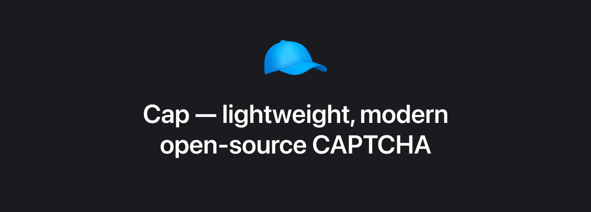

  

  <a href="https://capjs.js.org/">Documentation</a>
  &nbsp;&nbsp;•&nbsp;&nbsp;
  <a href="https://capjs.js.org/guide/">Quickstart</a>
  &nbsp;&nbsp;•&nbsp;&nbsp;
  <a href="https://capjs.js.org/guide/demo.html">Demo</a>
  &nbsp;&nbsp;•&nbsp;&nbsp;
  <a href="https://github.com/tiagorangel1/cap/issues/new">Issues</a>
   

### [Read the docs →](https://capjs.js.org)

## What is Cap?

Cap is a lightweight, modern open-source CAPTCHA alternative using SHA-256 proof-of-work. It's fast, private, and extremely simple to integrate. <a href="https://capjs.js.org/guide/effectiveness.html">Learn more about proof-of-work here.</a>

Cap is built into 2 main parts:

- **[@cap.js/widget](https://capjs.js.org/guide/widget.html)**: A small JavaScript library that renders the CAPTCHA and handles solving it using Web Workers and WASM.

- **[@cap.js/server](https://capjs.js.org/guide/server.html)**: An extremely simple, zero-dependencies library that handles creating and validating challenges.

There are also some other helpful packages:

- **[@cap.js/solver](https://capjs.js.org/guide/solver.html)**: Server-side solver for the CAPTCHA in case you want to use machine-to-machine.

- **[@cap.js/cli](https://capjs.js.org/guide/cli.html)**: Command-line interface for solving CAPTCHAs made with Cap. It's mainly designed for testing and when you need to solve these CAPTCHAs in a browser without JavaScript support.

- **[Standalone mode](https://capjs.js.org/guide/standalone.html)**: Docker image that helps you use Cap with any language or framework. It runs a simple REST API that can be used to create and validate challenges and an interactive UI to manage your keys.

It's designed to be a drop-in replacement for existing CAPTCHA solutions, with a focus on performance and UX.

Cap is built with JavaScript, runs on any JS runtime (Bun, Node.js, Deno), and has no dependencies. If you're not using any JS runtime, you can also use the standalone mode with Docker, which relies entirely on a simple REST API to create and validate challenges.

## Why Cap?

- **250x smaller than hCaptcha**  
  `@cap.js/widget` is extremely small, only 12kb minified and brotli'd.
- **Private**  
   Cap's usage of proof-of-work eliminates the need for any tracking, fingerprinting or data collection.
- **Fully customizable**  
   Cap's self-hostable so you can customize both the backend & frontend — or you can just use CSS variables
- **Proof-of-work**  
   Cap uses proof-of-work instead of complex puzzles, making it easier for humans and harder for bots
- **Standalone mode**  
   Cap offers a standalone mode with Docker, allowing you to use it with languages other than JS.
- **Invisible mode**  
   Cap can run invisibly in the background using a simple JS API.
- **Floating mode**  
   Cap's floating mode keeps your CAPTCHA hidden until it's needed.
- **Fully open-source**  
   Completely open source under the Apache license 2.0 license.

It's ideal for:

- Protecting APIs from bots
- Preventing spam on forms
- Blocking automated login attempts
- Securing free-tier abuse

## Alternatives

Cap is a modern alternative to:

- [reCAPTCHA](https://www.google.com/recaptcha/about/)
- [hCaptcha](https://www.hcaptcha.com/)
- [Cloudflare Turnstile](https://developers.cloudflare.com/turnstile/)

But unlike them, Cap is **computation-bound, not tracking-bound**.

## License

Cap is licensed under the Apache License 2.0.

---

