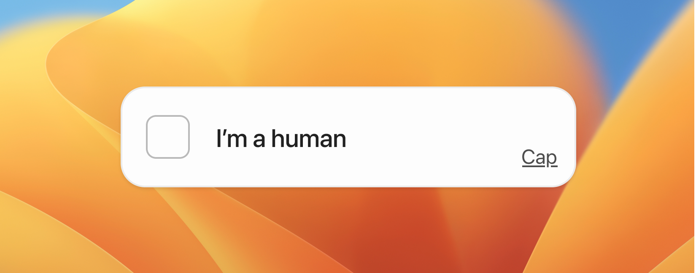

# cap — modern, lightning-quick PoW captcha

Cap is the modern open-source ReCAPTCHA alternative designed for speed. FOSS, lightweight, private and secure.

| [Learn more](https://cap.tiagorangel.com)
|----------|

  

**Note:** This is still a work in progress. It *should* work in production but you might stumble upon unexpected errors.

## Features
- **250x smaller than hCaptcha**:
  Cap is lightning fast, so your pages load instantly and users don't wait around
- **Private & GDPR compliant**:
  No more tracking or data collection. Cap is GDPR compliant and keeps your users' data private
- **Fully customizable**:
  Cap is self-hostable so you can customize both the backend & frontend — or you can just use CSS variables
- **PoW-based**:
  Cap uses PoW instead of frustrating image puzzles, making it easier and more private for humans
- **Headless mode**:
  Need silent protection? Cap can run invisibly in the background without any user interface
- **Floating mode**:
  The floating mode keeps your CAPTCHA hidden until it's needed, creating a smoother experience
- **Truly free**:
  Completely open source under AGPL-3.0. No hidden costs, no premium features, no surprises and completely FOSS
- **Easy to integrate**:
  Cap's web component & server-side library are super easy to integrate into your website

## Why Cap over Cloudflare Turnstile and other CAPTCHAS?

* **Why use this over Turnstile:** Cloudflare Turnstile is known for having an extremely high error rate, especially for users using private browsers such as Brave or Librewolf. Also, Cap is open-source.

* **Why use this over RECAPTCHA:** Cap is significantly smaller and faster than RECAPTCHA, open-source, fully free and  doesn't require you checking traffic signs due to its PoW nature.

* **Why use this over hCAPTCHA:** Not only is Cap's bundle 250x smaller than hCAPTCHA, it's open-source and doesn't require you checking traffic signs

* **Why use this over Altcha:** Cap is slightly smaller than altcha and easier to integrate, but if you don't care about that and want a more mature solution I would highly recommend checking it out.