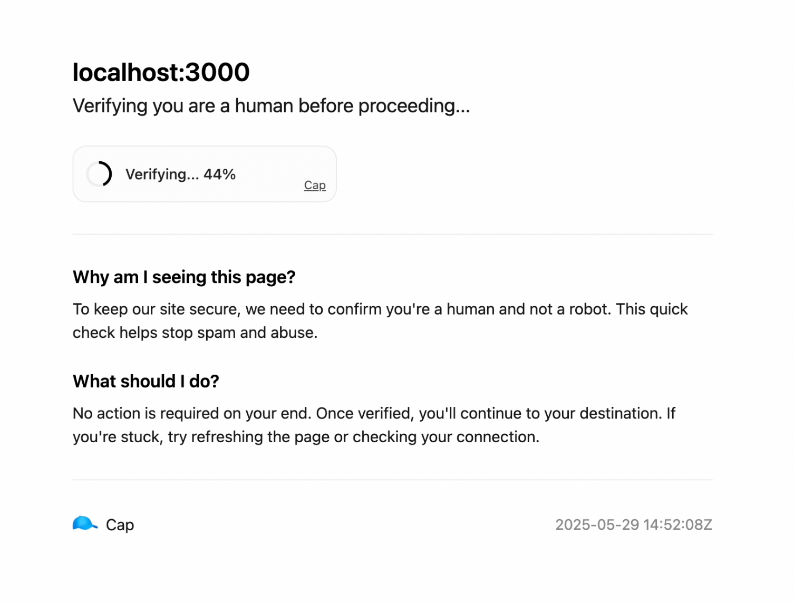

# About Middlewares

Cap's Middlewares allow you to replicate the experience of Cloudflare's browser check. This helps prevent bots, spam, and automated abuse before users ever reach your protected resource.

This is currently only available for Elysia, but we plan to support more frameworks in the future.

These are extremely simple to integrate and use.