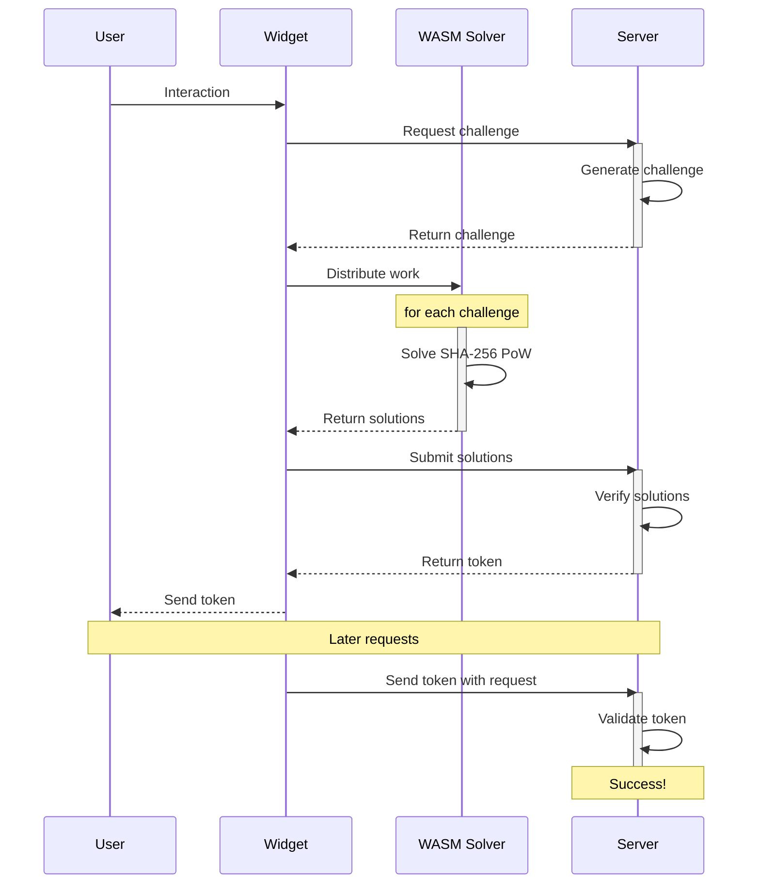

# How does cap work?

> [!NOTE]
> This is a more technical explanation of how Cap works. If you're looking for a more general overview, check out the [Effectiveness](./effectiveness.md) page.

#### Initialization

1. When Cap is initialized, it automatically registers a custom element for the widget in the browser's DOM.
2. The widget creates a shadow DOM and appends all necessary HTML elements to it, ensuring encapsulation from the rest of the page.

#### Requesting the challenge

3. When a solution is requested, the widget sends a request to the server to create a challenge set.
   - Each challenge consists of a unique salt and a target hash prefix.
   - The goal is to find a nonce value that, when combined with the salt and hashed using SHA-256, produces a hash that begins with the target prefix.
   - Instead of generating just one challenge, Cap creates multiple challenges to enable progress tracking and optimize performance.

#### Computing the solution

4. The widget leverages Web Workers to solve the challenges in parallel:
   - Each worker attempts to find a valid nonce by repeatedly:
     - Combining the salt with different nonce values
     - Computing the SHA-256 hash of this combination
     - Checking if the resulting hash begins with the target prefix
   - Workers increment the nonce systematically until a matching hash is found

#### Redeeming the solution for a token

5. Once a valid solution is found, the widget sends the result back to the server for validation.
6. Upon successful verification, the server redeems the solution and issues a token that can be used to authenticate the request.
